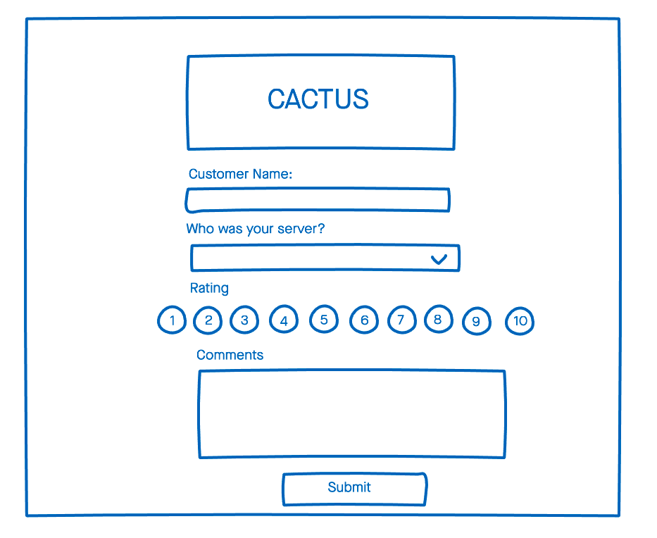
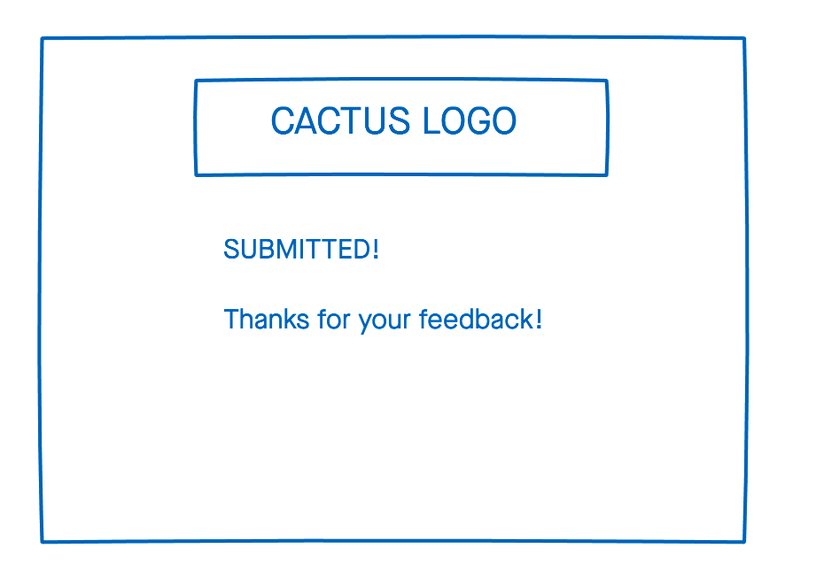
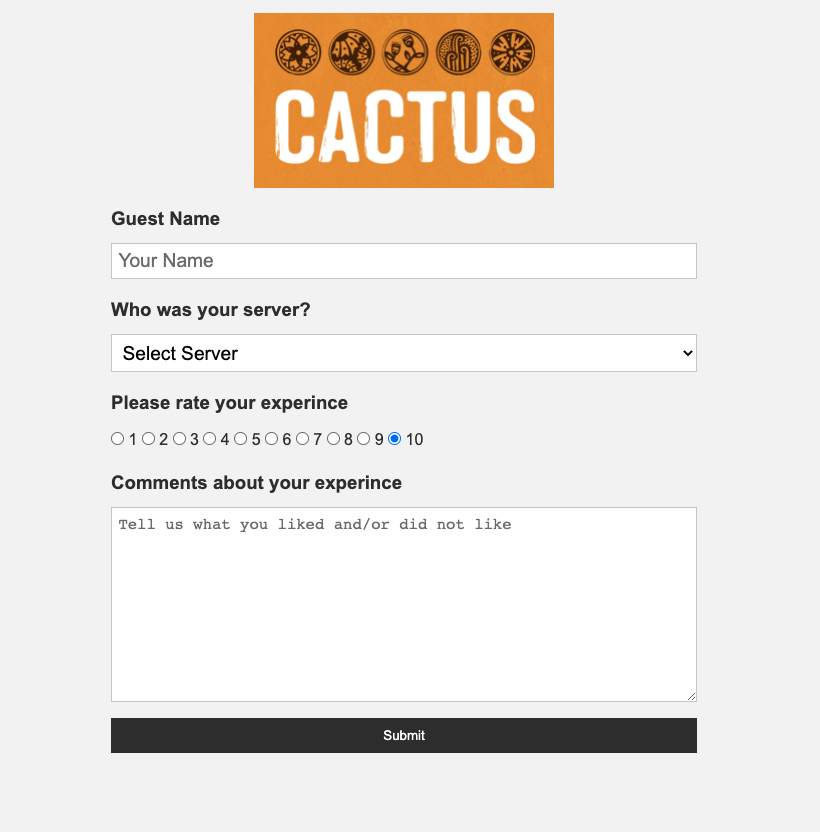
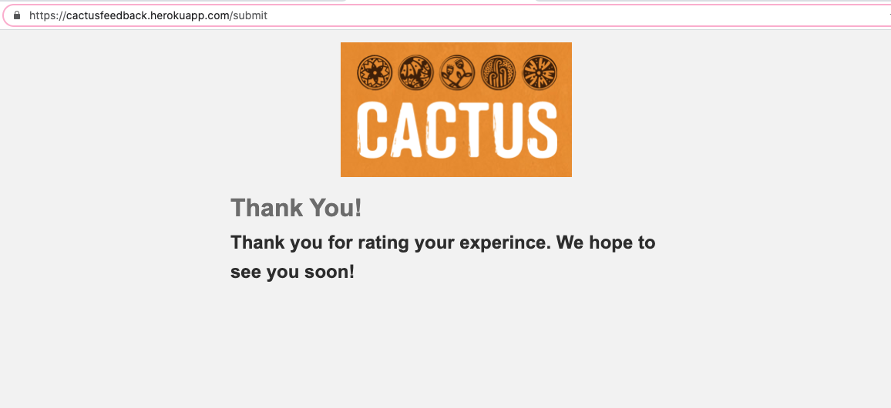

# Cactus Feedback
An application in which you can submit feedback about your experience at the restaurant

## Technologies Used
- HTML5
- CSS3
- Python3
- Flask
- Mailtrap.io
- Postgres
- pgAdmin4
- Heroku

## Wireframes

## Screenshots

## Getting Started
[Click Here](https://cactusfeedback.herokuapp.com/) to see the deployed app!

## Future Enhancements
- Have an email account set up and connected instead of the mailtrap.io
- Have a QR code to access the app for easy user experience
- Have a user add their email in order for the restaurant to contact them